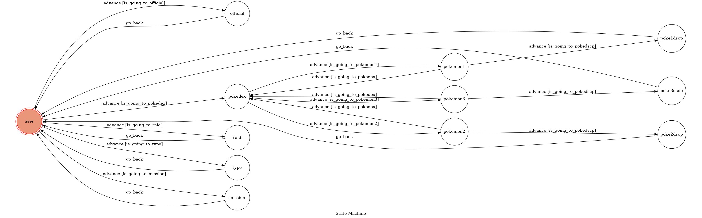

# TOC Project 2019
A chatbot you can get some information about Pokemon GO

## Setup
### Install Dependency
```sh
pip install -r requirements.txt
```

### Run the sever

```sh
python3 app.py
```

## Finite State Machine


## Usage
The initial state is set to `user`.

Every time `user` state is triggered to `advance` to another state, it will `go_back` to `user` state after the bot replies corresponding message.

* user
	* Input: "raid"
		* Reply: Image about raid boss

	* Input: "website"
		* Reply: Url to official website

	* Input: "mission"
		* Reply: Image about December's mission

	* Input: "type"
		* Reply: Image about Pokemon's type

The `pokedex` state will advance to `pokemon` state when postback button is pressed. Then advance to `pokexdscp` state when `關於` button is pressed. Otherwise, go back to `pokedex` when `返回` is pressed. `View More` button is a url to pokedex website. 

* user
	* Input: "pokedex"
		* Reply: Three button that you can choose a pokemon:
			* 急凍鳥
			* 火焰鳥
			* 閃電鳥

After `關於`, it will automatically go back to `user`.